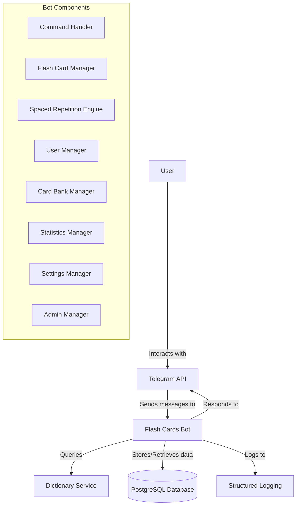
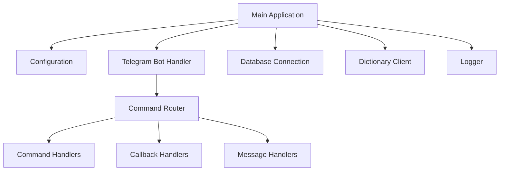
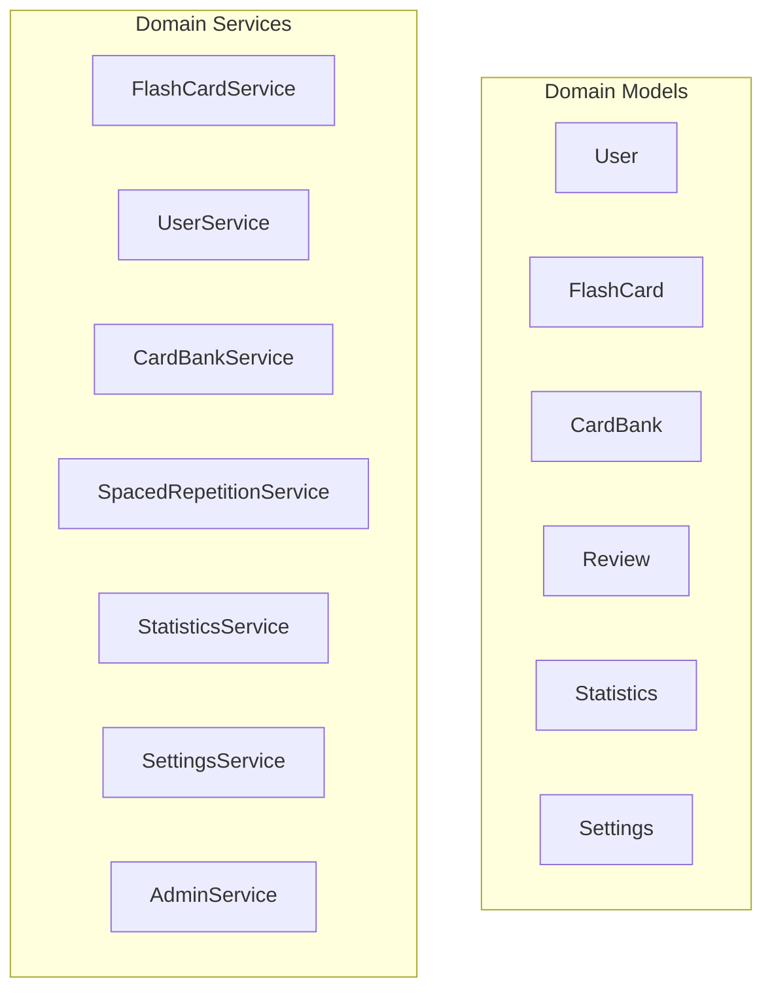
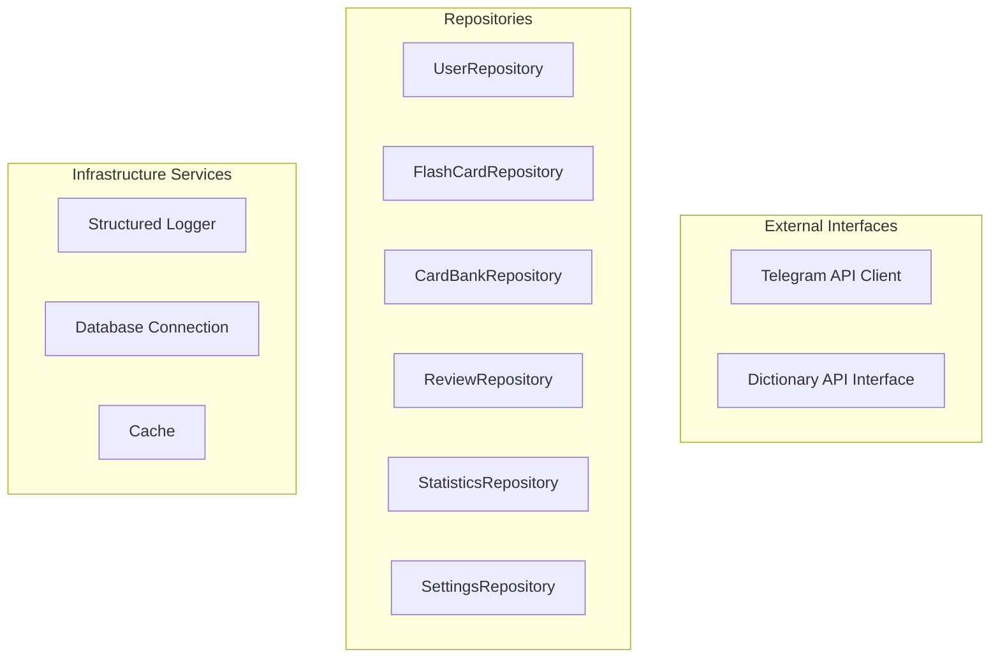
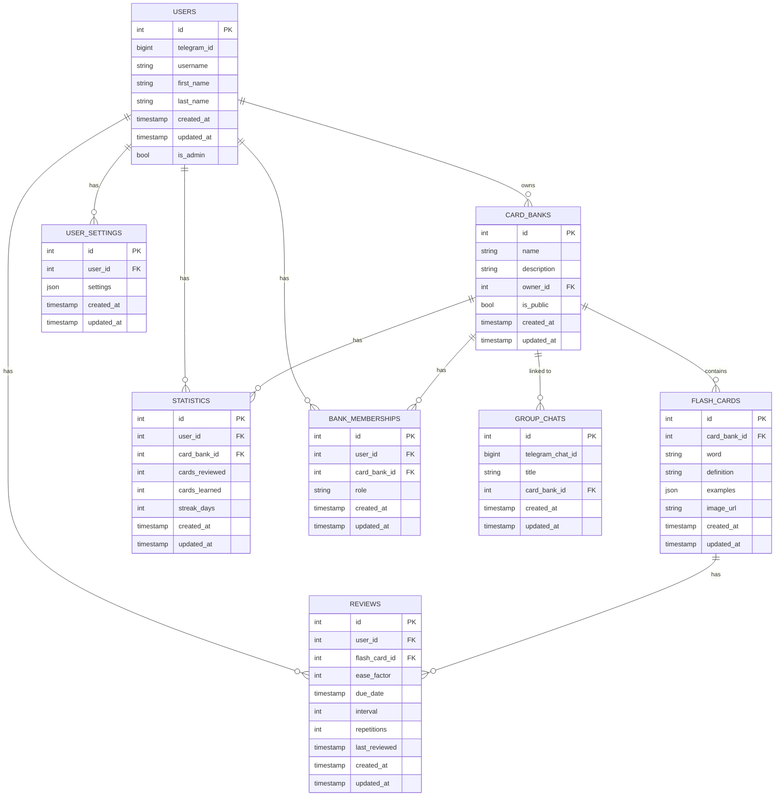
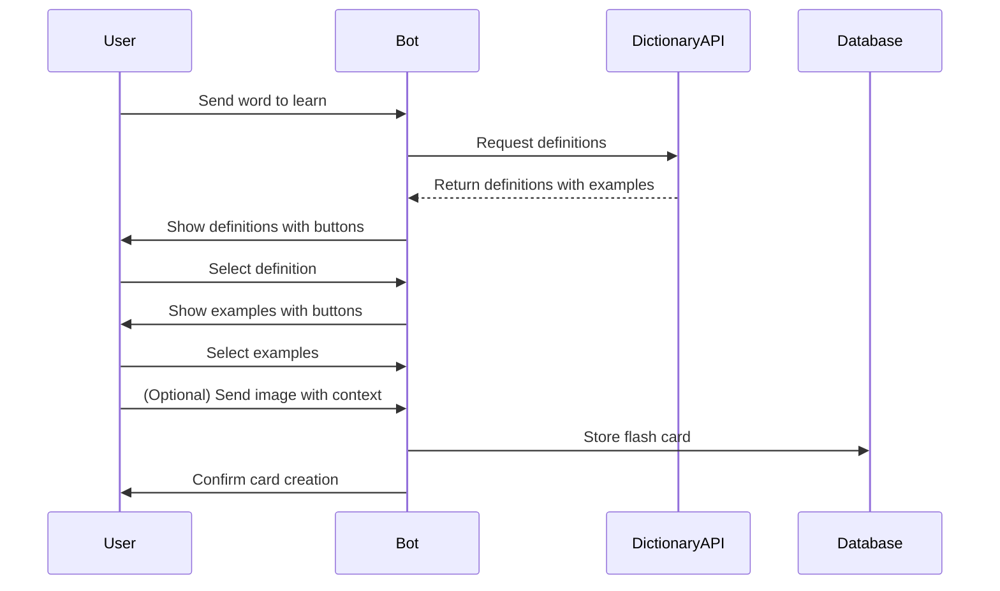
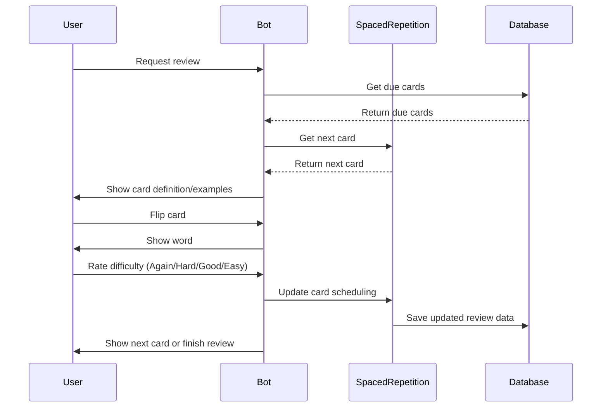
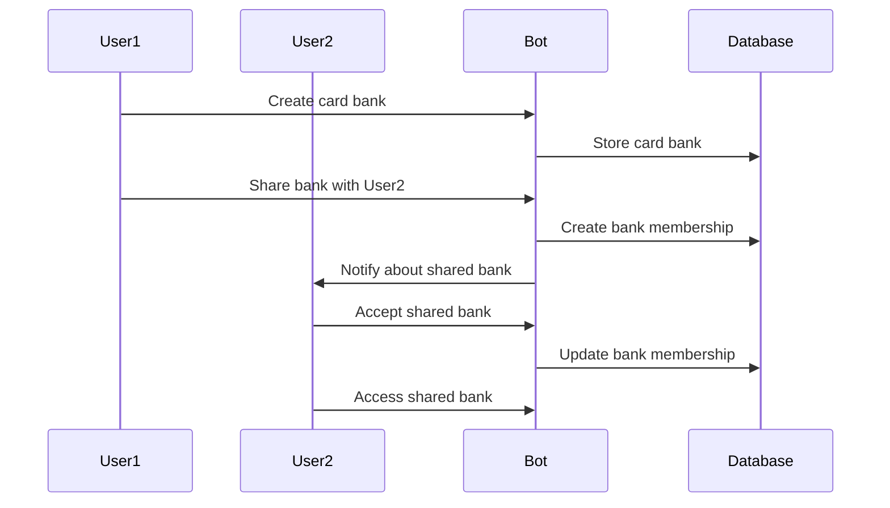
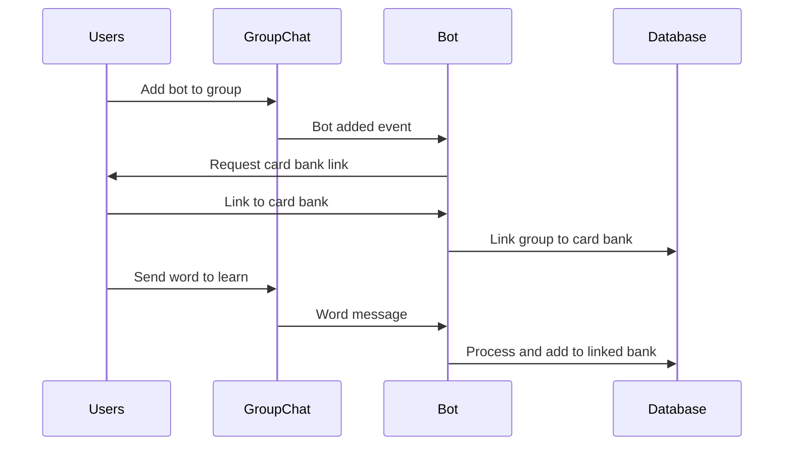
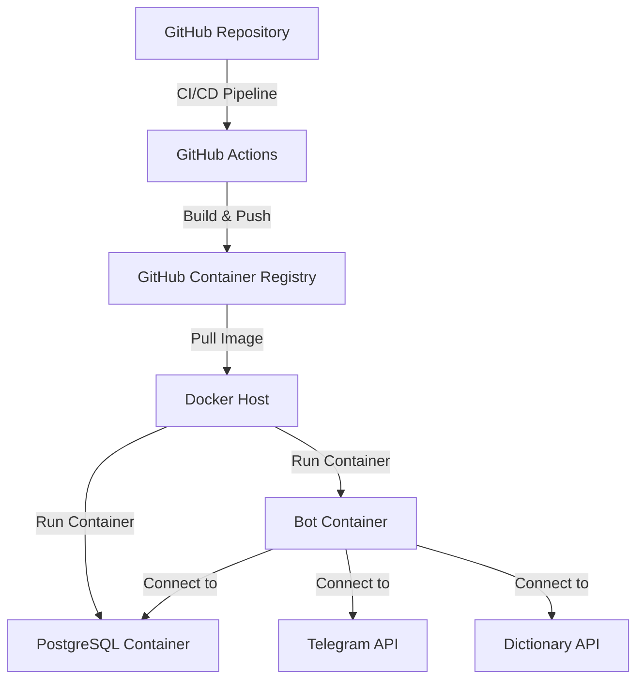

# Flash Cards Language Telegram Bot - Architecture

## System Overview

The Flash Cards Language Telegram Bot is a Golang application that helps users learn English vocabulary through a spaced repetition system similar to Anki, but within Telegram. The bot allows users to create flash cards with definitions and examples, review them using spaced repetition, track statistics, share card banks, and collaborate in group chats.



## Core Components

### 1. Application Layer



### 2. Domain Layer



### 3. Infrastructure Layer



## Database Schema



## Key Features Implementation

### 1. Adding Words to Create Flash Cards



### 2. Reviewing Words (Spaced Repetition)



### 3. Card Banks and Sharing



### 4. Group Chat Functionality



## Command Structure

```mermaid
graph TD
    TelegramUpdate[Telegram Update] --> UpdateRouter[Update Router]
    
    UpdateRouter --> CommandHandler[Command Handler]
    UpdateRouter --> CallbackHandler[Callback Handler]
    UpdateRouter --> MessageHandler[Message Handler]
    UpdateRouter --> PhotoHandler[Photo Handler]
    
    CommandHandler --> StartCommand[/start]
    CommandHandler --> HelpCommand[/help]
    CommandHandler --> AddWordCommand[/add]
    CommandHandler --> ReviewCommand[/review]
    CommandHandler --> StatsCommand[/stats]
    CommandHandler --> BanksCommand[/banks]
    CommandHandler --> CreateBankCommand[/create_bank]
    CommandHandler --> ShareBankCommand[/share_bank]
    CommandHandler --> JoinBankCommand[/join_bank]
    CommandHandler --> SettingsCommand[/settings]
    CommandHandler --> AdminCommand[/admin]
    
    CallbackHandler --> DefinitionCallback[Definition Selection]
    CallbackHandler --> ExampleCallback[Example Selection]
    CallbackHandler --> ReviewCallback[Review Rating]
    CallbackHandler --> BankCallback[Bank Selection]
    CallbackHandler --> SettingsCallback[Settings Selection]
    CallbackHandler --> PaginationCallback[Pagination]
    
    MessageHandler --> WordMessage[Word Input]
    MessageHandler --> SettingsMessage[Settings Input]
    MessageHandler --> AdminMessage[Admin Input]
    
    PhotoHandler --> ContextPhoto[Context Photo]
```

## Technical Architecture

### Project Structure

```
flash-cards-language-tg-bot/
├── cmd/
│   └── bot/
│       └── main.go
├── internal/
│   ├── app/
│   │   ├── app.go
│   │   └── config.go
│   ├── domain/
│   │   ├── models/
│   │   │   ├── user.go
│   │   │   ├── flashcard.go
│   │   │   ├── cardbank.go
│   │   │   ├── review.go
│   │   │   ├── statistics.go
│   │   │   └── settings.go
│   │   └── services/
│   │       ├── user_service.go
│   │       ├── flashcard_service.go
│   │       ├── cardbank_service.go
│   │       ├── spaced_repetition_service.go
│   │       ├── statistics_service.go
│   │       ├── settings_service.go
│   │       └── admin_service.go
│   ├── infrastructure/
│   │   ├── database/
│   │   │   ├── postgres.go
│   │   │   └── migrations/
│   │   ├── dictionary/
│   │   │   ├── dictionary.go
│   │   │   ├── free_dictionary.go
│   │   │   └── mock_dictionary.go
│   │   ├── telegram/
│   │   │   ├── bot.go
│   │   │   ├── handlers.go
│   │   │   └── keyboards.go
│   │   └── logging/
│   │       └── logger.go
│   └── repository/
│       ├── user_repository.go
│       ├── flashcard_repository.go
│       ├── cardbank_repository.go
│       ├── review_repository.go
│       ├── statistics_repository.go
│       └── settings_repository.go
├── pkg/
│   ├── utils/
│   │   └── helpers.go
│   └── spaced_repetition/
│       ├── algorithm.go
│       └── sm2.go
├── .env.example
├── .gitignore
├── docker-compose.yml
├── Dockerfile
├── go.mod
├── go.sum
└── README.md
```

## Deployment Architecture



## Configuration Management

The application will use environment variables for configuration, with an `.env.example` file provided as a template:

```
# Telegram Bot Configuration
TELEGRAM_TOKEN=your_telegram_bot_token
ADMIN_IDS=123456789,987654321

# Database Configuration
DB_HOST=postgres
DB_PORT=5432
DB_USER=flashcards
DB_PASSWORD=your_secure_password
DB_NAME=flashcards_db

# Dictionary API Configuration
DICTIONARY_API=freedictionary
DICTIONARY_API_KEY=your_api_key_if_needed

# Logging Configuration
LOG_LEVEL=info  # debug, info, warn, error
```

## Logging Strategy

Using Go's `slog` package for structured JSON logging with configurable log levels via environment variables.

## Testing Strategy

1. **Unit Tests**: For core business logic, services, and algorithms
2. **Integration Tests**: For repository implementations and external API clients
3. **End-to-End Tests**: For complete user flows using a mock Telegram API

## Security Considerations

1. **Environment Variables**: Sensitive information stored in environment variables
2. **Admin Access Control**: Restricted by Telegram IDs in environment variables
3. **Database Security**: Proper connection pooling, prepared statements to prevent SQL injection
4. **Input Validation**: All user input validated before processing
5. **Error Handling**: Proper error handling without leaking sensitive information

## Scalability Considerations

1. **Database Indexing**: Proper indexes on frequently queried fields
2. **Connection Pooling**: Efficient database connection management
3. **Caching**: Potential for caching frequently accessed data
4. **Stateless Design**: Bot designed to be stateless for horizontal scaling
5. **Containerization**: Easy deployment and scaling with Docker